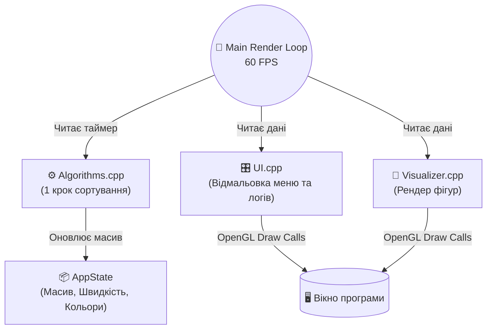

<div align="center">


# 🌌 NeoSort Visualizer

**Інтерактивний візуалізатор алгоритмів сортування на C++ та Dear ImGui.**

[🚀 Завантажити](#download) • [🐛 Повідомити про баг](https://github.com/DanyloLyk/NeoSort-Visualizer/issues)

</div>

## 📝 Про проєкт

**"NeoSort Visualizer"** — це потужний десктопний застосунок для покрокової візуалізації роботи алгоритмів сортування. Проєкт починався як серія з 7 університетських лабораторних робіт з алгоритмізації, але перетворився на повноцінний інструмент з гнучким UI та кастомним рендером.

Головна фішка застосунку — відмова від стандартної "веб-анімації". Це нативний C++ рушій, який дозволяє контролювати кожен кадр, змінювати теми оформлення (від класичної до Cyberpunk-неону) та взаємодіяти з масивами в реальному часі.

### 🚀 Ключові можливості

* 🧠 **7 Алгоритмів сортування:** Selection, Insertion, Bubble, Merge, Quick, Shell, Cocktail Shaker.
* 🎨 **4 Режими візуалізації:** Класичні стовпчики, Цифрові блоки, Кругові орбіти (Радар) та Світловий спектр.
* ⏸️ **Покроковий контроль:** Можливість ставити на паузу, змінювати швидкість від x0.1 до x10.0 під час роботи.
* 💻 **Cyberpunk UI:** Перемикач тем, який додає матричні фони, паралакс-сітки, неонові рамки та CRT-сканери.
* 🔢 **Системи числення:** Конвертація значень "на льоту" (Dec, Hex, Bin, Oct).
* ⚙️ **Кастомізація масивів:** Генерація випадкових масивів за заданими межами або ручне введення користувацьких даних.
* 📜 **Live-Логування:** Детальний вивід кожного кроку алгоритму з підсвіткою синтаксису.

## 🛠 Технічний стек

Проєкт побудований на високопродуктивному стеку для забезпечення стабільних 60+ FPS під час відмальовки тисяч елементів.

| Категорія | Технології | Обґрунтування |
| --- | --- | --- |
| **Мова** | `C++` | Максимальна продуктивність та контроль над пам'яттю. |
| **GUI Framework** | `Dear ImGui` | Блискавичний Immediate Mode графічний інтерфейс. |
| **Graphics API** | `OpenGL 3` / `GLFW` | Апаратне прискорення рендерингу (лінії, полігони, альфа-канали). |
| **Збірка** | `Make` | Проста та швидка компіляція проєкту. |

## 📂 Структура проєкту

Код розділено на логічні модулі для легкості підтримки та додавання нових алгоритмів.

```text
NeoSort/
├── src/
│   ├── algorithms.cpp   # 🧠 Логіка алгоритмів сортування (Лаби 1-7)
│   ├── visualizer.cpp   # 🎨 Рендер графіки (Стовпчики, Орбіти, Спектр)
│   ├── ui.cpp           # 🎛️ Інтерфейс користувача (Панелі, Кнопки, Теми)
│   └── main.cpp         # 🚀 Точка входу, ініціалізація GLFW та OpenGL
├── include/
│   ├── algorithms.h     # Заголовки алгоритмів
│   ├── visualizer.h     # Заголовки візуалізатора
│   ├── ui.h             # Заголовки UI
│   └── static.h         # 📦 Глобальний стан (AppState)
├── imgui/               # 📚 Бібліотека Dear ImGui
├── Makefile             # 🔨 Інструкції для збірки
└── README.md            # 📖 Цей файл

```

## 🏗 Архітектура (Immediate Mode)

На відміну від стандартних MVC веб-застосунків, тут використовується підхід **Immediate Mode GUI**. Кожен кадр (Frame) інтерфейс відмальовується з нуля на основі поточного стану (`AppState`).



## 🔥 Технічні виклики та рішення

### 🔴 Проблема: Рекурсія внімації (Quick Sort / Merge Sort)

* **Опис:** Стандартні рекурсивні алгоритми сортують масив за мілісекунди, не даючи рушію відмалювати проміжні кадри. Затримка `sleep()` "вішала" б весь інтерфейс.
* **Рішення:** Рекурсію було повністю переписано на **ітеративний підхід**. Замість викликів функцій використано `std::vector` як стек завдань (Stack), що дозволило зберігати стан і відмальовувати алгоритм покроково в головному циклі програми.

### 🔴 Проблема: Рвані анімації блоків

* **Опис:** Під час обміну елементів (Swap) блоки миттєво "телепортувалися" на нові місця.
* **Рішення:** Інтегровано систему **Keyframing** та математичну функцію `sin()` для розрахунку параболічних траєкторій. Це створило ілюзію плавного "стрибка" елементів один над одним.

### 🔴 Проблема: Динамічна стилізація (Theme Switching)

* **Опис:** Перемикання між класичною та Cyberpunk темою вимагало перезапису сотень кольорів у процесі роботи програми.
* **Рішення:** Розроблено розумний менеджер тем, який змінює вказівники на `ImVec4` кольори тільки у момент зміни стану чекбокса, уникаючи зайвого навантаження на процесор під час рендеру.

<a id="download"></a>
## 🚀 Інструкція з запуску

Проєкт підтримує компіляцію як на Linux, так і на Windows.

### 🐧 Linux (Arch / Ubuntu)

Для збірки знадобляться базові інструменти компіляції та бібліотеки GLFW/OpenGL.

**1. Встановлення залежностей:**

```bash
# For Arch Linux:
sudo pacman -S base-devel cmake glfw-x11 fonts-noto-core

# For Ubuntu/Debian:
sudo apt update
sudo apt install build-essential cmake libglfw3-dev libgl1-mesa-dev libglew-dev fonts-noto-core
```

**2. Клонування та збірка:**

```bash
git clone https://github.com/DanyloLyk/NeoSort-Visualizer.git
cd NeoSort-Visualizer
git submodule update --init --recursive  
```

**3. Запуск:**

```bash
cd build
rm -rf *
cmake ..
make
./Algorithms
```

### 🪟 Windows (MinGW)

#### **-------------------1 спосіб-------------------**

Для збірки на Windows рекомендується використовувати середовище MSYS2, яке надає доступ до інструментів GNU, включаючи MinGW-w64, `cmake` та `make`.

**1. Встановлення MSYS2 та залежностей:**

1.  Завантажте та встановіть [MSYS2](https://www.msys2.org/).
2.  Відкрийте термінал **MSYS2 MinGW 64-bit**.
3.  Оновіть пакети:
    ```bash
    pacman -Syu
    pacman -Su
    ```
4.  Встановіть необхідні інструменти для збірки та бібліотеки:
    ```bash
    pacman -S --needed base-devel mingw-w64-x86_64-toolchain mingw-w64-x86_64-cmake mingw-w64-x86_64-glfw
    ```

**2. Клонування та збірка:**

1.  Клонуйте репозиторій та його підмодулі:
    ```bash
    git clone https://github.com/DanyloLyk/NeoSort-Visualizer.git
    cd NeoSort-Visualizer
    git submodule update --init --recursive
    ```
2.  Створіть директорію для збірки та скомпілюйте проєкт:
    ```bash
    mkdir build
    cd build
    cmake -G "MinGW Makefiles" ..
    mingw32-make
    ```

**3. Запуск:**

Після успішної збірки, запустіть програму з директорії `build`:
```bash
./Algorithms.exe
```

#### **-------------------2 спосіб-------------------**
1.  Клонуйте репозиторій:
    ```bash
    git clone https://github.com/DanyloLyk/NeoSort-Visualizer.git
    cd NeoSort-Visualizer
    ```
2.  Запустіть програму
    ```bash
    ./NeoSort.exe
    ```
---

<div align="center">
<sub>Розроблено як пет-проєкт і не тільки. 2026 </sub>
</div>
